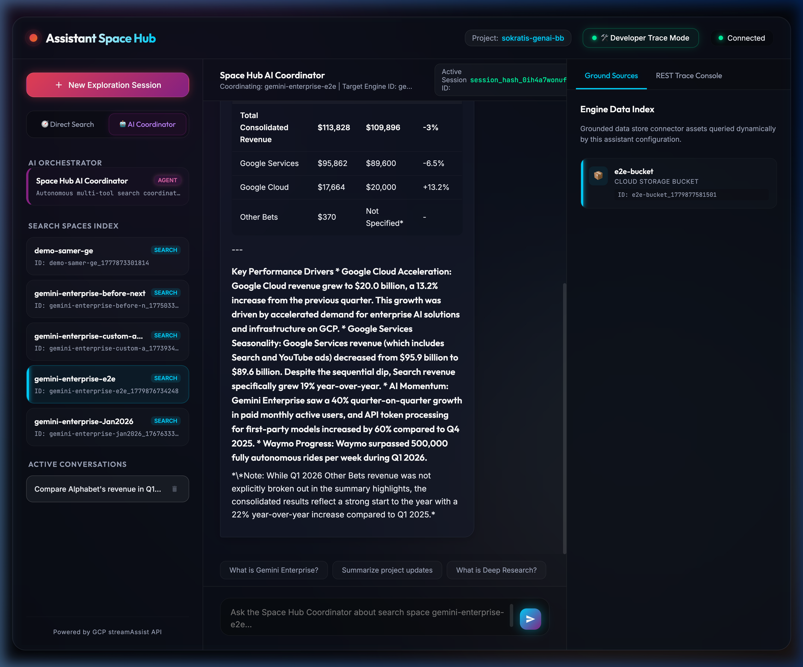
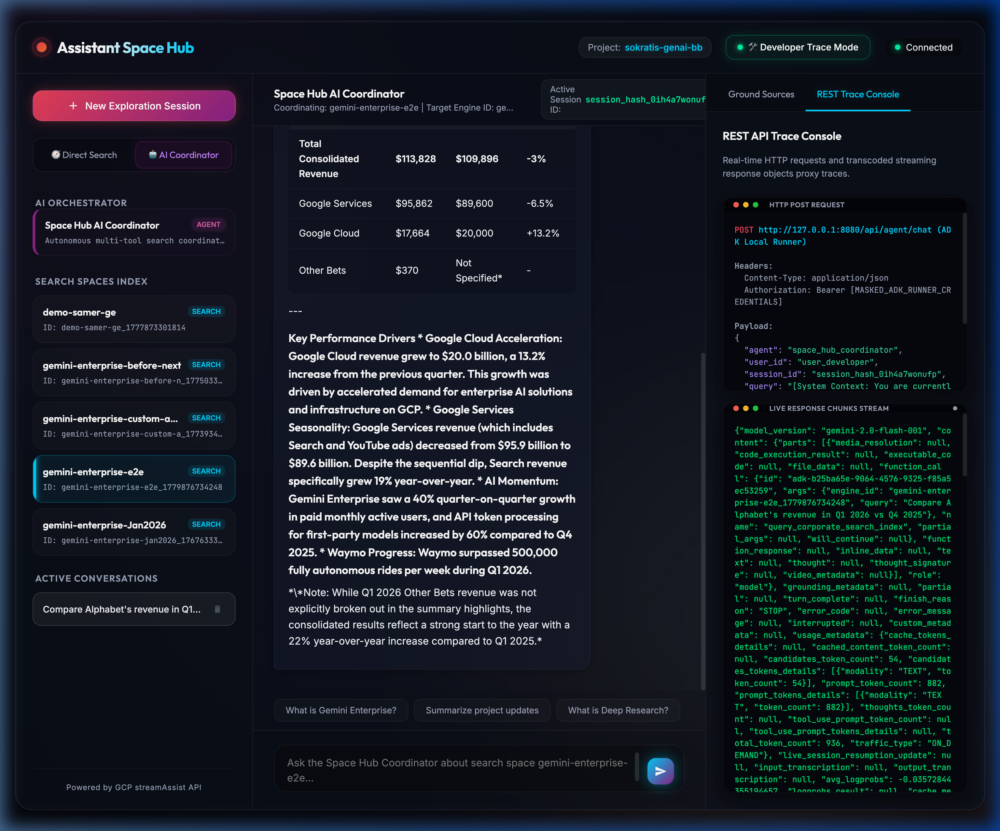
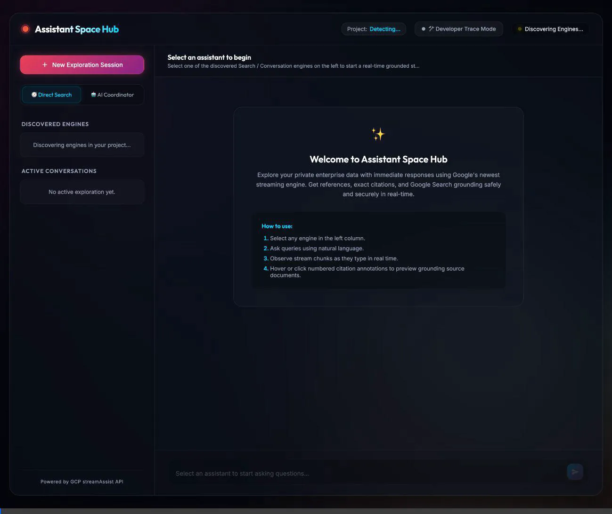

# 🌌 Gemini Enterprise - Assistant Space Hub

> **High-Fidelity Enterprise Search Grounding & Coordinated ADK Agentic Console**

Assistant Space Hub is a secure, full-stack, real-time grounded exploration dashboard designed to query, compare, and trace private enterprise search engines created in Google Cloud Platform's Discovery Engine API. 

Built with a **FastAPI Backend-for-Frontend (BFF)** proxy architecture, a **Google Agent Development Kit (ADK)** local runner engine, and a **Glassmorphic Space-Theme Web UI**, it integrates direct search proxies streams and an intelligent orchestrated assistant persona to analyze deep document citations (e.g. from financial earnings release PDFs) completely safely.

---

## 📸 Coordinated Multi-Engine Chat Dashboards

| 📦 Grounded Data Stores Panel | 🛠️ Highlighted Target Override Payload |
| :--- | :--- |
|  |  |

---

## 🎨 Visual Verification Walkthroughs

The visual verification walkthrough sequence is documented under **[WALKTHROUGH.md](file:///Users/sokratis/Documents/Code/0_playground/WALKTHROUGH.md)**. 

Open **[coordinated_agent_demo.webp](file:///Users/sokratis/Documents/Code/0_playground/docs/assets/coordinated_agent_demo.webp)** to see the animation of our local target coordinated agent stream: toggling modes, selecting `gemini-enterprise-e2e` card under agent mode, verifying dynamic data stores collections uncollapse, submitting earnings comparative prompts, tracking targeted request system envelopes inside REST console request log terminals, streaming dynamic tool warning badges, and outputting YoY comparative revenues tables!



---

## 🚀 Key Architectural Features Implemented

### 1. Secure Backend-for-Frontend (BFF) Auth Proxy
To completely neutralize risk and comply with standard enterprise token protection rules (**CWE-312: Cleartext Storage** and **CWE-922: Insecure Storage**), all high-privilege credentials and Bearer access tokens are encapsulated entirely server-side. 
*   No service keys or API tokens are ever stored, transmitted, or processed in the client browser's memory scope.
*   FastAPI is bound strictly to localhost `127.0.0.1` and executes rigorous anti-clickjacking headers (`X-Frame-Options: DENY`, `X-Content-Type-Options: nosniff`, and `Content-Security-Policy: default-src 'self'`).

### 2. Conversational Orchestration (Google ADK Local Agent & Runner)
TALK to an advanced corporate coordinator agent directly using natural conversational language.
*   **Local InMemoryRunner Streaming**: FastAPI lazy-loads and instantiates the `google.adk.runners.InMemoryRunner` locally. Traces actual python GenAI Event dictionaries chunk-by-chunk directly into the browser logs response console in real-time.
*   **Dynamic Tool Calling & Warnings Balloons**: Integrates the agent with standard docstring-mapped Python tools. If the agent makes intermediate decisions to list search spaces or query document databases, a custom glowing tool calling status chip renders inside the chat stream in real-time: `🤖 Space Hub Coordinator: [Invoking Tool...]`.
*   **Prism Architectural Decoupling (Shared `util.py` Library)**: Extracted all GCP credentials resolutions, listing engines API mappings, and streamAssist transcode generator methods into a shared, centralized, stateless utilities library **`util.py`**. This completely decouples local ADK Agent tools and CLI test scripts, letting them statically import functions directly on top of the files with zero port loopbacks or circular dependency locks!

### 3. Dynamic Datastore Routing Engine
Bypassing the traditional several-hours latency during console sync states:
*   Upon query submission, the BFF automatically interrogates the GCP Engine details in real-time.
*   It dynamically auto-discovers linked database indexes (such as your newly created GCS bucket index `e2e-bucket_1779877581501`).
*   It constructs a dynamic `toolsSpec` POST configuration block on-the-fly and overlays the target indices within the `streamAssist` execution body, delivering instantaneous multi-document search grounding.

### 4. Collapsible Developer Trace Console (Triple-Column Grid Shift)
Clicking `🛠️ Developer Trace Mode` dynamically transitions the fluid web space grid into a triple-column layout, uncollapsing a Frosted Glass Space panel carrying two visual consoles:
*   **Engine Grounded Sources Panel**: Translates mapped indices list arrays returned during discovery to visual storage cards carrying dynamic SVG icons (boxes `📦` for bucket indices, envelopes `✉️` for mail datasets, folders `📁` for drives etc.), user-friendly cleaned display tags, database types, and complete GCP resource ID text fields.
*   **REST API Trace Console**: Maps real-time HTTP interaction shells:
    *   **HTTP POST REQUEST Terminal**: Traces targeted POST methods, raw URL endpoints, masked authorization headers, and a color-coded syntax-highlighted Request JSON Payload.
    *   **LIVE RESPONSE CHUNKS STREAM Terminal**: Emulates an active Linux server logging shell. Carries a red blinking warning indicator dot active during connection streams and prints byte-for-byte the compact transcoded JSON string chunks exactly as flushed by Google Cloud, scrolling container focus margins downward in real-time.

### 5. XSS-Safe Recursive DOM Tokenizer
To securely parse and syntax-color JSON strings and payloads without using hazardous `innerHTML` or string parsing injections (**CWE-79: XSS Prevention**):
*   Implemented a recursive browser-native DOM highlighter that tokenizes object datatypes (strings, keys, numbers, booleans, arrays).
*   It dynamically creates and mounts native text blocks and span elements (`document.createElement()`, `document.createTextNode()`, `textContent`) on-the-fly, locking down browser context boundaries from active script executions.

### 6. Grounded Markdown progressive Parser
*   Processes compact transcoded REST buffers in real-time and translates markdown markers progressively.
*   Safely generates nested list items, bullet headers, and formats gorgeous financial table margins to output grounded financial figures accurately.
*   Maps completed text segments to assigned citation annotations badges `[1]`, `[2]`, overlaying absolute coordinates float hover preview cards on hover, and linking reference cards securely to GCS storage PDF endpoints in the footer sources drawer.

---

## 📂 Core Workspaces Code Map

*   ⚙️ **[server.py](file:///Users/sokratis/Documents/Code/0_playground/server.py)**: Secure FastAPI BFF backend microservice. Handles CORS authorizations middlewares, secure headers injection, session configurations, and local ADK agent runner SSE transcoding loops. Delegated API proxyings completely to `util.py`.
*   ⚙️ **[util.py](file:///Users/sokratis/Documents/Code/0_playground/util.py)**: Centralized, authenticated GCP credentials and streamAssist transcode generator library. Coordinates Application Default Credentials (ADC) token refreshes, global environment variables setups, list engines Discovery Engine clients, and real-time proxy streaming connections.
*   🤖 **[agent/](file:///Users/sokratis/Documents/Code/0_playground/agent/)**: Coordinated AI Orchestration package folder.
    *   ⚙️ [agent.py](file:///Users/sokratis/Documents/Code/0_playground/agent/agent.py): Wire instructions and models.
    *   ⚙️ [tools.py](file:///Users/sokratis/Documents/Code/0_playground/agent/tools.py): Local Python tools mapping. Statically imports utilities from `util.py` (Listing online databases, dynamic search grounding routing).
    *   ⚙️ [prompts.py](file:///Users/sokratis/Documents/Code/0_playground/agent/prompts.py): System instructions persona.
    *   ⚙️ [agent.json](file:///Users/sokratis/Documents/Code/0_playground/agent/agent.json): Standard A2A card specifications.
*   🖼️ **[static/index.html](file:///Users/sokratis/Documents/Code/0_playground/static/index.html)**: Main HTML5 shell. Structures dynamic columns grid layout, header badging trackers, suggestions capsules, relative overlays, and side trace console terminals.
*   🎨 **[static/style.css](file:///Users/sokratis/Documents/Code/0_playground/static/style.css)**: Glassmorphic deep-space style stylesheet. Implements radial blur auroras, pulsing indicator rings, macOS Unix terminal boxes styling, custom scrolling handles, and sidebar uncollapse transitions.
*   🧠 **[static/app.js](file:///Users/sokratis/Documents/Code/0_playground/static/app.js)**: Front-end orchestration controller. Handles local history cache sessions separation, progressive stream DOM renderer, citation annotations overlays calculations, dynamic storage type iconography triggers, and recursive XSS-safe highlighted console JSON engines.

---

## 🔑 Authentication Infrastructure Details

To guarantee 100% security, Assistant Space Hub manages authentication in two distinct layers depending on the active stage (Local Sandbox vs Production Platform).

### 1. Local Development Sandbox Authentication (Active Now)
When running the application locally on your workstation, authentication is facilitated via **Application Default Credentials (ADC)**. 

```
  [Local Workstation CLI]              |      [FastAPI BFF Server Sandbox]      |       [Google Cloud Platform]
                                       |                                        |
  1. developer$ gcloud auth login      |                                        |
  2. developer$ gcloud auth application-default login                           |
     (Writes credentials token locally to:                                      |
      ~/.config/gcloud/application_default_credentials.json)                    |
                                       |                                        |
                                       |   3. google.auth.default()             |
                                       |      (Locates and loads ADC JSON)      |
                                       |                                        |
                                       |   4. AuthorizedSession(credentials)    |
                                       |      (Generates/refreshes Bearer OAuth)|
                                       |      * signs outgoing REST requests    |
                                       |                                        |
                                       |   5. ADK models / streamAssist         | -- [Signs with Bearer Token] -> Discovery Engine
                                       |      (Routes API calls securely)       |
```

*   **ADC Resolution**: Inside **[util.py:L20](file:///Users/sokratis/Documents/Code/0_playground/util.py#L20)**:
    ```python
    credentials, GCP_PROJECT_ID = google.auth.default()
    session = AuthorizedSession(credentials)
    ```
    The `google.auth.default()` method searches your workstation's system parameters sequentially:
    1.  `GOOGLE_APPLICATION_CREDENTIALS` env variable path.
    2.  The global workstation gcloud configuration location (`~/.config/gcloud/application_default_credentials.json` which you authorize via terminal!).
    3.  Metadata service attributes (when hosted on App Engine or Cloud Run).
*   **Token Refresh & Cryptographic Signing**: The local FastAPI server uses `AuthorizedSession` to manage token lifespans. It dynamically requests standard OAuth 2.0 access token refreshes behind the scenes, and signs every search index request securely on the server side:
    `Authorization: Bearer <GCP_ACCESS_TOKEN>`
    No keys are ever stored or exposed inside the client dashboard browser memory.

### 2. Google GenAI SDK Vertex AI Integration
To validate and run our local ADK `InMemoryRunner` coordinator agent model calls without needing a separate manual `api_key` environment variable:
We map the resolved credentials project and location parameters directly inside **[util.py](file:///Users/sokratis/Documents/Code/0_playground/util.py#L24-L28)**. This forces Google's new GenAI SDK transport layers to automatically authorize model queries under your workstation's authenticated GCP access rights:
```python
os.environ["GOOGLE_GENAI_USE_VERTEXAI"] = "1"
os.environ["GOOGLE_CLOUD_PROJECT"] = GCP_PROJECT_ID
os.environ["GOOGLE_CLOUD_LOCATION"] = "us-central1"
```

### 3. Multi-User Production Authentication Scaling
To scale this development dashboard to an online multi-tenant enterprise portal, authorization is managed using standard **3-Legged OAuth 2.0 delegation**:

```
  [Browser Client space]        |         [Secure BFF Backend Server]        |        [GCP IAM / OAuth Broker]
                                |                                            |
  1. Click 'Authenticate Platform'                                           |
  2. Opens Consent Popup - - - - - - - - - - - - - - - - - - - - - - - - - - - - - > Authenticates credentials
                                |                                            |       & requests authorization scopes
  3. Grant Authorization - - - - - - - - - - - - - - - - - - - - - - - - - - - - - - [User Consents]
                                |                                            |             |
  4. Callback Redirect carrying |                                            |             v
     auth code '?code=xyz' - -  | - - - - - - - - - - - - - - - - - - - - - - - - -  Returns Code 'xyz'
                                |                                            |
                                |  5. Exchange auth code 'xyz' server-side:  |
                                |     POST /credentials:finalize  - - - - - - - - > Validates and stores secure
                                |                                            |       User-Delegate Bearer Token
                                |                                            |
                                |  6. Reads User-Delegate Token from Vault   |
                                |  7. signs LLM / Search API requests        | -- [Signs with User Delegate] -> Search API
```

1.  **Identity Assertion (SSO)**: The user signs into the portal via an IDP client (like Google Workspace OIDC). The backend saves user details in an encrypted cookie with settings `HttpOnly; Secure; SameSite=Strict`.
2.  **Consent Popup Authorization**: The dashboard intercepts credentials requests, opening a popup window directing the user to the Google OAuth consent form.
3.  **Auth Code Exchange Flow**: Upon user consent, the callback redirects the browser to the backend callback redirect endpoint carrying an authorization code `?code=abc`.
4.  **Finalize Credentials Vaulting**: The secure BFF server grabs the code and submits a secure server-side POST request calling the Google IAM Connector Credentials API `finalize` endpoint. This exchanges the code for a **User-Delegate Token** which is safely stored inside a secure credentials vault (like GCP Secret Manager).
5.  **User Scopes Boundary Enforcement**: When the ADK agent triggers a search tool, the BFF retrieves that specific user's delegate token from the vault. Outgoing API requests are signed utilizing the *user's personal token*. The Google Search engines then evaluate document permissions strictly against that *user's specific GSuite access rights* (not the server's service accounts!), ensuring strict enterprise context isolation.

---

## 🏁 Step-by-Step Run Guide

Follow these simple, clear terminal commands to boot and test the entire full-stack solution locally.

### 📋 System Prerequisites
Before booting, verify that your local machine has the following tools active:
*   **Python 3.10** or higher (verify via: `python3 --version`).
*   **Google Cloud SDK** (verify via: `gcloud --version`).
*   An active Google Cloud project with the **Discovery Engine API** enabled and at least one Search or Chat engine configured (which you can discover using this dashboard!).

---

### 1. Authenticate your Workstation
Map your personal credentials profile to the terminal so the server and local tests can resolve GCP authentication.

Run these commands in your shell terminal:
```bash
# 1. Authorize your main terminal account
gcloud auth login

# 2. IMPORTANT: Establish local Application Default Credentials (ADC) tokens file
gcloud auth application-default login

# 3. Target the active project ID where engines reside
gcloud config set project sokratis-genai-bb
```
*Note: The second command launches a browser tab asking you to sign in. Granting access writes a local JSON token that allows Python libraries to safely connect without manual secret keys.*

---

### 2. Install Python Packages
Navigate to the project root workspace directory, and install all required framework dependencies:
```bash
pip install fastapi uvicorn google-auth google-cloud-discoveryengine google-genai google-adk requests
```

---

### 3. Start the BFF Backend Server
Run the FastAPI web backend server process. Uvicorn will load, authenticate credentials, spin up local ADK models model context wrappers, and host static web dashboard assets:
```bash
python3 server.py
```
You should see these logging outputs in your terminal:
```
INFO:BFF_Server:Successfully authenticated server for GCP Project: sokratis-genai-bb
INFO:BFF_Server:Initializing Vertex AI SDK globally. Project: sokratis-genai-bb...
INFO:BFF_Server:Instantiating local InMemoryRunner mapping for ADK Coordinator agent...
INFO:     Started server process [9137]
INFO:     Application startup complete.
INFO:     Uvicorn running on http://127.0.0.1:8080 (Press CTRL+C to quit)
```
*Note: The server is bound strictly to localhost interface `127.0.0.1:8080` for secure local port sandbox containment.*

---

### 4. Open the Web Dashboard Panel
1.  Launch your browser and navigate to: **[http://127.0.0.1:8080](http://127.0.0.1:8080)**.
2.  Observe the header: connection badge displays a green `Connected` pulsing orb and displays project `sokratis-genai-bb`.
3.  Choose your room exploration mode at the top left toggle headers:
    *   **🧭 Direct Search**: Talks to search engines directly. Select `gemini-enterprise-e2e` in the sidebar and enter search prompts to explore grounding citations drawers popups and raw REST terminals logs.
    *   **🤖 AI Coordinator**: Talks to the advanced coordinated agent.
        *   *Autonomous Mode*: Click `Space Hub AI Coordinator` agent card in the sidebar. Enter general prompts (e.g. asking to summarize your search engines), and watch the agent use dynamic tools autonomously in the background!
        *   *Targeted Mode*: Click any discovered engine card below the agent card (e.g., `gemini-enterprise-e2e`) while in the Coordinator room. The agent header updates and locks the coordinator's reasoning scope specifically targeting that index!
4.  Toggle **`🛠️ Developer Trace Mode`** on the top right header to uncollapse visual logs terminals mapping live HTTP Request payloads and Event chunks scrolling logs.

---

### 5. Run a CLI ADK Agent Verification Test
If you prefer to run and test the new conversational ADK Agent directly from your terminal console without launching any web browsers:

Open a separate terminal window, navigate to the project directory, and run the verified scratch runner:
```bash
python3 scratch/test_adk_agent.py
```
This runs the local `InMemoryRunner` loop, submits an engine-discovery prompt, and prints out the conversational responses, tools calls parameters, and raw python GenAI event dictionary segments on your terminal in real-time!
```
INFO:google_adk.google.adk.models.google_llm:Sending out request, model: gemini-2.0-flash-001...
Greetings! I am the Space Hub AI Coordinator...

[AGENT INTERMEDIATE DECISION] Tool Call triggered: list_available_search_engines
Arguments payload: {}

*   gemini-enterprise-e2e: (`gemini-enterprise-e2e_1779876734248`) - Data store connected is e2e-bucket.
...
```
